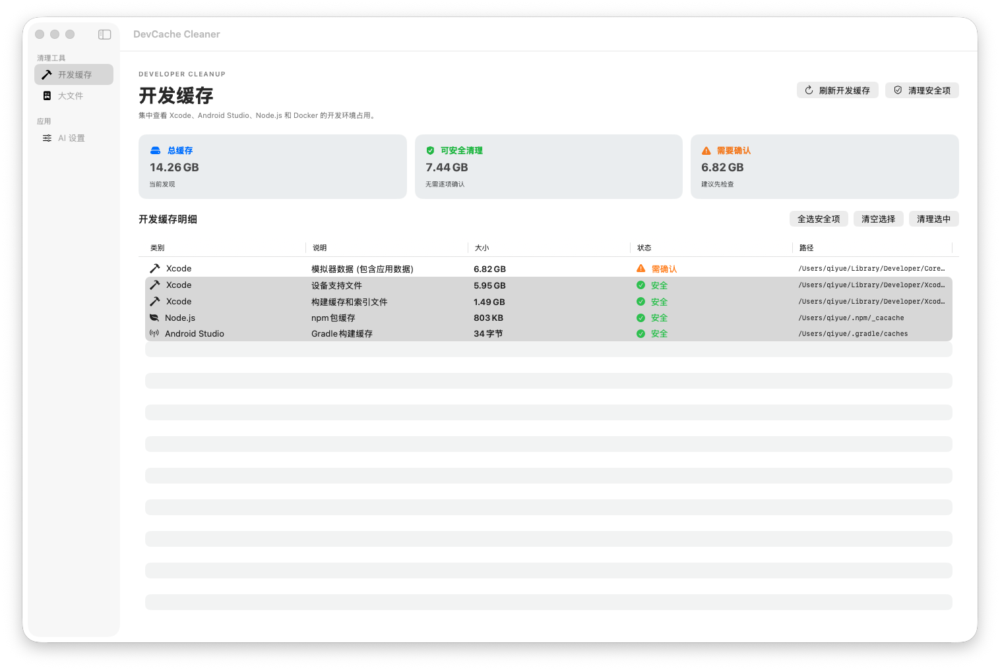

# DevCache Cleaner

> A native macOS utility for cleaning developer caches and finding large files.  
> 一款原生 macOS 开发者缓存清理与大文件管理工具。

[English](#english) · [中文](#中文)

## English

DevCache Cleaner helps developers reclaim disk space without permanently deleting files. It analyzes common development caches, finds large files, and moves selected items to the macOS Trash so they can be restored if needed.

### Features

- Analyze Xcode, Android Studio, Gradle, npm, Yarn, pnpm, and simulator caches.
- Scan accessible disk locations for large regular files.
- Set a configurable large-file threshold from 100 MB to 100 GB.
- Sort results by size and inspect path, type, and modification date.
- Delete individual items or multiple selected items at once.
- Reveal files in Finder.
- Move deleted items to Trash instead of permanently removing them.
- Skip protected system locations, application bundles, and Time Machine data during large-file scans.
- Separate developer-cache, large-file, and AI settings workspaces.
- Analyze one or multiple large files or developer-cache entries through an OpenAI-compatible model without uploading file contents.
- Double-click an entry to start AI analysis, or select multiple entries and analyze them together.
- Generate a cautious deletion recommendation and a reviewable Trash command with one-click copy.

### AI configuration

The default provider is OpenRouter's free-model router:

- Base URL: `https://openrouter.ai/api/v1`
- Model: `openrouter/free`

Enter your API key in the app's **AI Settings** page. The key is stored in local macOS user settings and is intentionally not committed to this public repository. A safe configuration template is available at [AIConfiguration.example.json](AIConfiguration.example.json). Never commit a real API key to source code, packages, or releases.

### Screenshots




### Requirements

- macOS 13.0 or later
- Swift 5.9 or later

### Build

```bash
swift build -c release
```

Build the macOS installer package:

```bash
./scripts/package-local.sh
```

The package is written to `dist/DevCacheCleaner.pkg`.

### Run

```bash
swift run DevCacheCleanerApp
```

For broader disk access, grant the app permission in **System Settings → Privacy & Security → Full Disk Access**. macOS may still skip locations that are unavailable to the current user.

### Safety

DevCache Cleaner is designed to be conservative:

- Deletion is confirmed in the UI.
- Files are moved to Trash and are recoverable until Trash is emptied.
- System-critical paths are excluded from large-file scans.
- Cache entries are classified as safe or requiring confirmation.

### License

MIT License. See [LICENSE](LICENSE).

## 中文

DevCache Cleaner 帮助开发者释放磁盘空间，同时避免直接永久删除文件。它可以分析常见开发工具缓存、查找大文件，并将选中的内容移动到 macOS 废纸篓，方便需要时恢复。

### 功能

- 分析 Xcode、Android Studio、Gradle、npm、Yarn、pnpm 和模拟器缓存。
- 扫描可访问磁盘位置中的大文件。
- 支持设置 100 MB 到 100 GB 的大文件阈值。
- 按大小排序，并显示路径、类型和最后修改时间。
- 支持单项删除和多选批量删除。
- 支持在访达中定位文件。
- 删除内容统一移动到废纸篓，不直接永久删除。
- 扫描大文件时跳过系统关键目录、应用程序包和 Time Machine 数据。
- 开发缓存、大文件和 AI 设置分别使用独立页面。
- 支持通过 OpenAI-compatible 大模型批量分析大文件和开发缓存，不上传文件内容。
- 双击项目即可开始 AI 分析，也可以多选后批量分析。
- 给出中文的谨慎删除建议，并支持一键复制废纸篓命令。

### AI 配置

默认使用 OpenRouter 免费模型路由：

- Base URL：`https://openrouter.ai/api/v1`
- 模型：`openrouter/free`

请在应用的 **AI 设置** 页面填写 API Key。Key 只保存在本机 macOS 用户设置中，不会提交到这个公开仓库。项目提供了安全的配置模板 [AIConfiguration.example.json](AIConfiguration.example.json)，请不要把真实 Key 提交到源码、安装包或 Release。

### 界面截图


### 系统要求

- macOS 13.0 或更高版本
- Swift 5.9 或更高版本

### 构建

```bash
swift build -c release
```

构建 macOS 安装包：

```bash
./scripts/package-local.sh
```

安装包会生成在 `dist/DevCacheCleaner.pkg`。

### 运行

```bash
swift run DevCacheCleanerApp
```

如需扫描更多磁盘内容，请在 **系统设置 → 隐私与安全性 → 完全磁盘访问权限** 中授权本应用。macOS 仍可能跳过当前用户无法访问的位置。

### 安全机制

DevCache Cleaner 采用保守的清理策略：

- 删除操作需要在界面中确认。
- 文件会移动到废纸篓，在清空废纸篓前可以恢复。
- 大文件扫描会排除系统关键路径。
- 缓存项目会区分“安全清理”和“需要确认”。

### 许可证

MIT License，详见 [LICENSE](LICENSE)。
